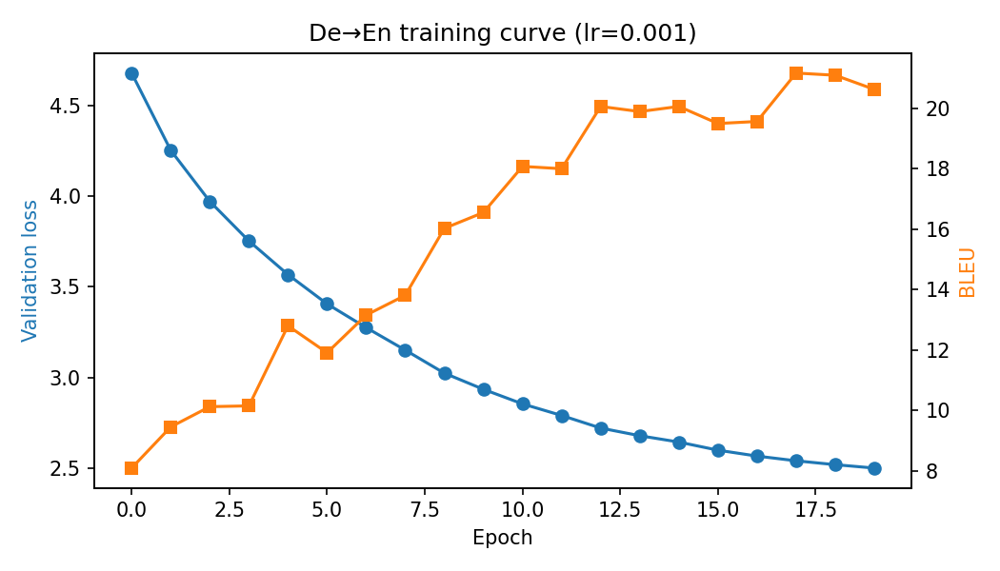

# GPT-2-Style Transformer for German→English Translation

A decoder-only Transformer language model, trained end-to-end for German→English machine translation on IWSLT14. The model is implemented on **miniTorch**, a small deep learning framework with its own tensor library and autodiff, and trained on a V100 GPU on the PSC Bridges-2 cluster.

> Course project for CMU 11868 *Large Language Model Systems*.
> Source code is not published here because this is a graded course assignment. This repo contains the design write-up, experiment results and analysis. I'm happy to walk through the code in an interview.

## Highlights

- Implemented the core of a **GPT-2-style model**: pre-LN Transformer blocks, multi-head causal self-attention, learned positional embeddings and a language-model head.
- Built the supporting pieces on top of miniTorch tensor ops: `Linear`, `LayerNorm`, `Embedding`, `Dropout`, a numerically stable `logsumexp` and a softmax cross-entropy loss.
- Wrote the autoregressive decoding loop and the BLEU evaluation pipeline.
- Reached **20.6 BLEU** (best **21.2**) on De→En after 20 epochs, with validation loss falling from 4.68 to 2.50.
- Diagnosed a non-converging training run (loss stuck near 5.3) and fixed it by lowering the learning rate.
- Ran long training jobs on a shared HPC cluster with Slurm, including a resume-from-checkpoint wrapper.

## Results



Final configuration: learning rate 0.001, 20 epochs. Full per-epoch numbers are in [`results/eval_summary.csv`](results/eval_summary.csv).

| Epoch | Validation loss | BLEU |
|---:|---:|---:|
| 0 | 4.68 | 8.1 |
| 4 | 3.57 | 12.8 |
| 9 | 2.93 | 16.5 |
| 12 | 2.72 | 20.1 |
| 17 (best BLEU) | 2.54 | 21.2 |
| 19 (final) | 2.50 | 20.6 |

**Learning-rate comparison**

| Run | Learning rate | Epochs run | Validation loss | BLEU |
|---|---:|---:|---|---|
| Default config | 0.02 | 16 | 5.30–5.55 (flat) | 0.1–3.1 (erratic) |
| Tuned | 0.001 | 20 | 4.68 → 2.50 (steady) | 8.1 → 20.6 |

Notes on the numbers:

- BLEU is SacreBLEU corpus-level BLEU with greedy decoding, computed on **100 test sentences**. With a test set this small, BLEU moves by about ±1 between neighbouring epochs, so I treat the trend as more meaningful than any single epoch.
- Validation loss is measured on the full filtered validation split (4,512 pairs) and decreases smoothly, which makes it the more reliable signal.

Sample translations, including some failure cases, are in [`results/sample_translations.md`](results/sample_translations.md).

## Model at a glance

| Item | Value |
|---|---|
| Architecture | Decoder-only Transformer, pre-LN (GPT-2 style) |
| Layers / heads | 4 layers, 8 heads (32 dims per head) |
| Embedding dim | 256 |
| Feed-forward hidden dim | 256, GELU activation |
| Vocabulary | 10,000, byte-level BPE trained on the corpus |
| Context length | 40 tokens |
| Dropout | 0.1 |
| Parameters | about 6.7M |
| Optimizer | Adam, learning rate 0.001, batch size 128 |

The full design write-up is in [`docs/architecture.md`](docs/architecture.md).

## What I built

| Area | Work |
|---|---|
| Tensor functions | Numerically stable `logsumexp`, and softmax cross-entropy built from it |
| Basic modules | `Linear`, `LayerNorm1d`, `Embedding`, `Dropout` (inverted dropout, off in eval mode) |
| Transformer | Multi-head attention with causal masking, pre-LN Transformer layer, full `DecoderLM` |
| Pipeline | Greedy autoregressive `generate`, wired into training, evaluation and BLEU scoring |
| Infrastructure | Slurm batch jobs, log monitoring, checkpoint/resume wrapper |

## How translation works

Source and target are packed into a single sequence: `<German tokens> <eos_de> <English tokens> <eos_en> <pad>…`. The model is trained as an ordinary next-token language model, but the loss is masked so that only English target tokens contribute. At inference the German sentence and `<eos_de>` are fed in, and the model generates English tokens one at a time until it emits `<eos_en>` or reaches the context limit.

## Training setup

- **Data:** IWSLT14 De-En (`bbaaaa/iwslt14-de-en-preprocess` on Hugging Face). Pairs whose combined length is 40 words or more are dropped, leaving 97,976 train and 4,512 validation pairs. The test set is the first 100 test sentences.
- **Schedule:** 20 epochs of 20,000 randomly sampled training pairs each, about 157 optimizer steps per epoch.
- **Compute:** one V100 (16 GB). Roughly 48 minutes of training per epoch, plus about 3 minutes for validation and 3–6 minutes for generation.
- **Seed:** 11111.

## Engineering notes

**Debugging a non-converging run.** With the default learning rate of 0.02, validation loss barely moved (5.48 at epoch 0, 5.33 at epoch 15) and BLEU oscillated below 4. The model was running without errors but not learning. Lowering the learning rate to 0.001 fixed it: loss dropped steadily and BLEU climbed to about 20. This pointed to optimization instability rather than a structural problem in the model. It also cost about 16 GPU-epochs of wasted compute, so on a rerun I would check the loss curve after two or three epochs before committing to a long job.

**Long jobs on a shared cluster.** Interactive `srun` sessions died whenever my SSH connection dropped. I moved training to `sbatch` batch jobs, which keep running independently of my terminal, and monitored them through log files. I also hit a slow login shell (module system scanning a network filesystem) and a home-directory quota, and worked around both.

**Resumability without touching the provided script.** To protect against job timeouts, I wrote a small wrapper that patches the training entry point at runtime: it saves model weights after each epoch and reloads them on restart. This kept the course-provided training script unmodified.

**A decoding bug.** My first version of `generate` crashed at the end of epoch 0 because miniTorch tensors do not support partial indexing. Training and validation had already run for about 45 minutes by then. The fix was to move the logits to NumPy before slicing. Lesson: test the generation path on a tiny model before launching a long job.

## Limitations and ideas for improvement

- Decoding is greedy and recomputes the whole prefix at every step (no key/value cache), which makes generation slow.
- BLEU is measured on only 100 sentences, so it is noisy.
- No learning-rate warmup or decay schedule; adding one would probably allow a higher peak learning rate.
- No beam search, label smoothing or weight tying, all of which usually help translation quality.

## Repo contents

```
README.md
docs/architecture.md          design write-up
results/eval_summary.csv      validation loss and BLEU for all 20 epochs
results/learning_curve.png    training curve
results/sample_translations.md
scripts/plot_results.py       regenerates the table and plot
```

## References

- Vaswani et al., [*Attention Is All You Need*](https://arxiv.org/abs/1706.03762)
- Radford et al., *Language Models are Unsupervised Multitask Learners* (GPT-2)
- Xiong et al., [*On Layer Normalization in the Transformer Architecture*](https://arxiv.org/abs/2002.04745)
- [miniTorch](https://minitorch.github.io)
- [SacreBLEU](https://github.com/mjpost/sacrebleu)
- Course: [CMU 11868 Large Language Model Systems](https://github.com/llmsystem/llmsys_hw3)

## Acknowledgements

The miniTorch framework, starter code and CUDA-backed tensor operations were provided by the course staff and are not included in this repo. The model components, decoding and evaluation pipeline, experiments and analysis in this write-up are my own work.
